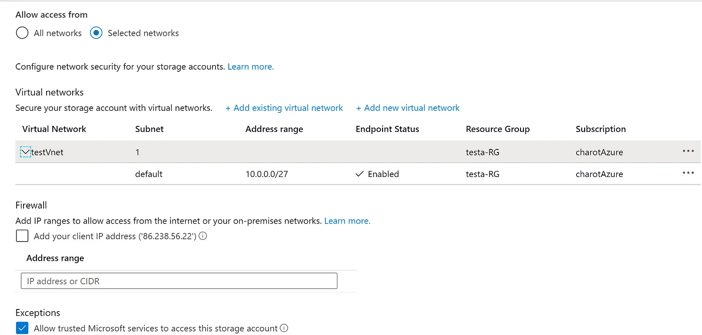
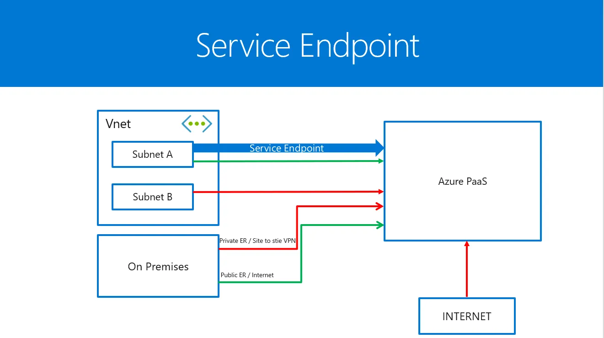
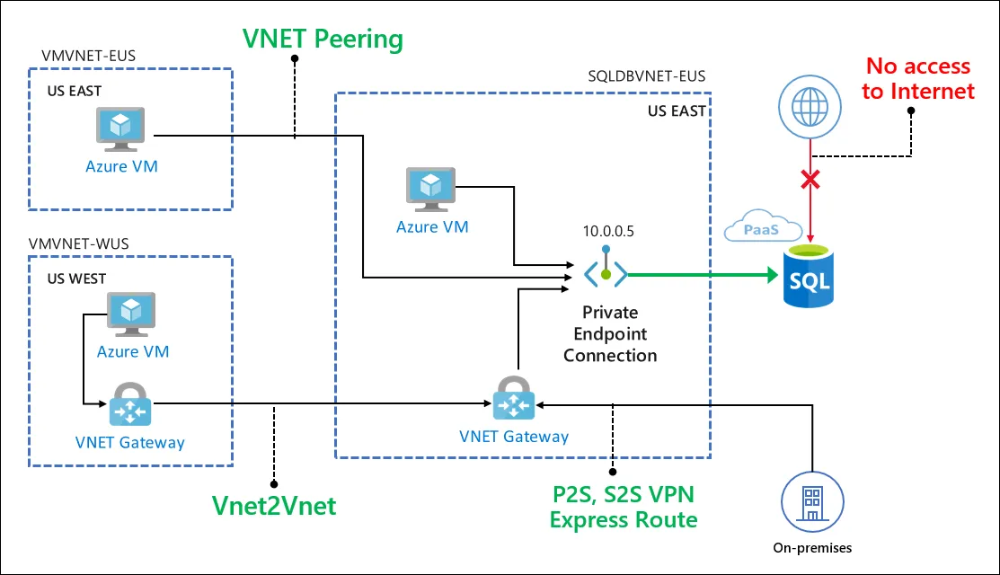
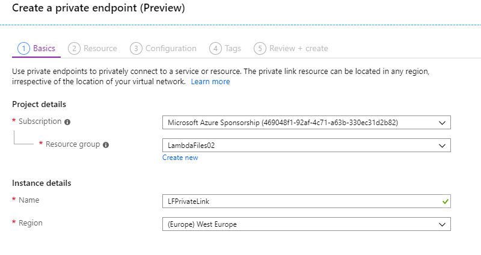
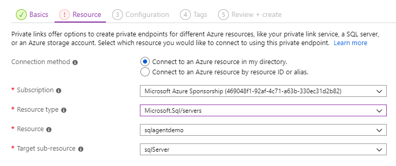
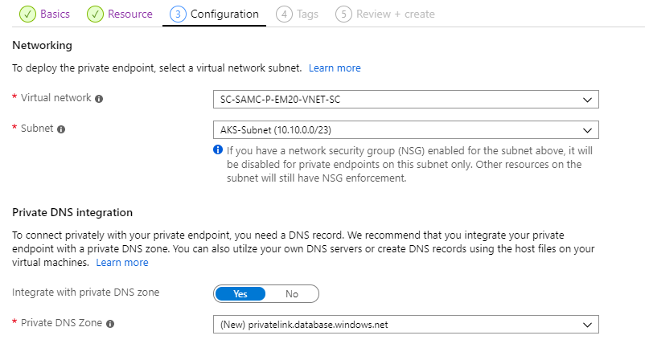
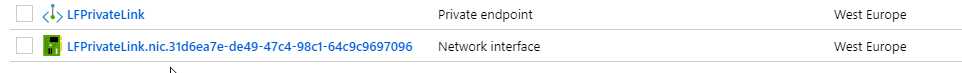

# Automate Azure Private Link using ARM Templates

### [View all Roadmaps](https://github.com/nholuongut/all-roadmaps) &nbsp;&middot;&nbsp; [Best Practices](https://github.com/nholuongut/all-roadmaps/blob/main/public/best-practices/) &nbsp;&middot;&nbsp; [Questions](https://www.linkedin.com/in/nholuong/)
 

This week (16th September 2019) we saw the announcement of a new service, Azure Private Link. If you are using a mix of Azure Infrastructure as a Service (IaaS) and Platform as a Service (PaaS), then this is big news. It’s also going to be a very useful new tool for service providers delivering services in Azure. So what is Azure Private Link?

Before talking automation, let’s talk about Azure Private Link and why a lot of companies are waiting for it.

Until now, some Azure PaaS Services (Such as Azure Storage Account, Azure SQL DB …) expose a public IP Address which allows customers to establish connection with them. The only way to secure these services was to enable a Service Endpoint to restrict the access to these Azure PaaS Services. However, theses services stay reachable using a Public IP Address.

How ? well, Azure uses Software-Defined Networking (SDN) for the internal operations. But when it comes to the communication from outside. Azure uses mainly Internet. So the idea is to put in place Virtual Networks so we can run on the Azure Backbone. By enabling Service Endpoint, your traffic pass via Microsoft network backbone. This does not mean you bring your Azure PaaS services to a VNet, it just remains the traffic on the Microsoft network backbone. But as I told you, the services still have a public IP Address.

By enabling the service endpoint:

Only the subnet “default” inside the VNET “testVnet” and trusted MS services will have access:

Wait wait, “Enterprise Private Network” does not have access ? Unfortunately no, as I told you, The Azure PaaS services expose a public IP so an internal private network won’t have direct access using a private Express Route or a Site-To-Site VPN.

How can we solve that ? how can we provide to these Azure PaaS Services a private endpoint so that the Enterprise Private Network can have a secure access ?

The Azure Private Link will allow customers to reach Azure Services via a private connection without any internet requirement. Your services will have private internal IP so the clients may access using a Site-To-Site VPN or Private ER.

# What is Azure Private Link?
Private Link is new functionality for selected PaaS services that allows you to create a private endpoint in your virtual network. Your private endpoint provides an internal IP for your PaaS service, and all traffic from your virtual network to the PaaS resource goes over the Microsoft backbone and not out over the internet. Enabling private Link for a PaaS resource provides several benefits:
- A private IP to reference your PaaS resources.
- Traffic to PaaS resources traverses the Microsoft network.
- Supports access from both peered virtual networks and on-premises resources connected via Express Route or VPN.
- Users access is now restricted solely to the specific resource (database, storage account, etc.) not the whole service, so you have complete control of data egress.
- Private endpoints can be created to resources in different regions to the virtual network and even different tenants

Private Link has a second set of benefits, and that is for service providers. Private Link allows you to create private endpoints across tenants, and to create endpoints for Azure Load Balancers. This is reffered to as a “Private Link Service”. Private Link Services allow service provides to create a private endpoint for their applications and use Private Link to inject these into a client’s virtual network. This provides service providers with a way to grant clients secure access to their applications, with traffic never traversing the internet, while retaining the ability to manage the application and underlying infrastructure. This is a significant new capability for service providers and how they deliver applications to customers.

# Private Link vs Service Endpoints

One question that comes to mind when thinking about Private Link is how does this differ from Service Endpoints?

Service endpoints provide a way to lock down access to PaaS resources to a virtual network; however, you are still accessing a public endpoint; it is just locked down to specific traffic. With service endpoints, you are also only locking down access to a service, not to a specific resource. With Private Link, the private endpoints allow access only to the specific resource.

Because private Link creates an endpoint with a private IP, your traffic is flowing solely inside your virtual network and does not require NSG rules allowing outbound traffic beyond your virtual network, unlike service endpoints.

# How does Azure Private Link Work?
To set up a Private Link, we use the new “Private Link Center” in the portal, which tracks and lists all of your links. The first part of the setup is to create the actual link object, this needs to sit in a resource group and region, but this can be a different region and resource group to the actual resource and vNet.

Next, we need to confirm the resource we want to connect to. We can either pick the resource in our tenant or provide the ID of a resource in another tenant. If you are connecting to a resource in your tenant you first need to select the service type, at present the following services are supported:

- Azure SQL
- Azure SQL Data Warehouse
- Azure Storage
- Azure Data Lake Sorage Gen 2
- Private Link Services - Applications from service providers

In the example below, we are connecting to a SQL server.

Next, we configure the virtual network which the Private Link endpoint will be made available. We also have the option here to integrate with an Azure Private DNS zone. This will allow us to resolve the address of the resource, such as sqlagentdemo.database.windows.net, to its private IP. If you have your own DNS servers, you can instead add the record to these.

You then have the usual options to create tags and review before we deploy.

Once the deployment has completed, in the resource group you selected, you will see two items. First, the private link service object, secondly a network interface. This NIC is your PaaS resources connection to your virtual network.

If you select the network card, you will see the private IP that has been allocated to your PaaS resource. You can connect directly with this IP, or using a DNS entry. You now have private access to your PaaS resource.

Private Links can also be created using Azure PowerShell and CLI.

# **NOTES**
## Why would I want to use Azure Private Link?
Private Link is a crucial component for securing access to PaaS resources and providing virtual network integration for multi-tenant services. If you want to be able to have PaaS resources of part of your vNet, then this service is going to be a great resource, especially as more services are added. If you are concerned about reducing the exposure your PaaS services have to the internet and securing the traffic between your network and Azure then you are going to want to look at this service.

From a service provider perspective, this is a big leap forward in being able to provide access to customers securely in their virtual network while maintaining the ability to manage and support the resources in the service providers subscription. I anticipate this leading to a wide range of new services being offered by third parties and service providers.

## What issues does Azure Private Link have?
The most obvious issue is that Private Link is only just in preview, so it’s not supported for production workloads and it is bound to have issues in the short term. The preview is also limited to only a few services - SQL, Storage and Private Link Services. Over time more services will be added. Private Link is also restricted to certain regions at the moment, see [here](https://docs.microsoft.com/en-us/azure/private-link/private-link-overview#availability for details.

Private Link endpoints cannot co-exist with service endpoints in the same subnet at the moment, so you will need to use one or the other. This will be more of an issue during the preview where the amount of services support is relatively low, and you may wish to use service endpoints for other services.

Private Link endpoints also don’t abide by NSG rules. You can have NSG’s on a subnet with Private Links, and other traffic will still abide by them, but Private Link traffic will not.

If you are looking to use Private Link as a service provider to offer services to clients, you must use a Standard Load Balancer to front end your service; you cannot use a Basic Load Balancer.

Finally, at present, there is no support for creating Private Links with ARM templates. Private Link Services for service providers is also limited to PowerShell and CLI.

# 🚀 I'm are always open to your feedback.  Please contact as bellow information:
### [Contact ]
* [Name: nho Luong]
* [Skype](luongutnho_skype)
* [Github](https://github.com/nholuongut/)
* [Linkedin](https://www.linkedin.com/in/nholuong/)
* [Email Address](luongutnho@hotmail.com)
* [PayPal.me](https://www.paypal.com/paypalme/nholuongut)

# License
* Nho Luong (c). All Rights Reserved.🌟